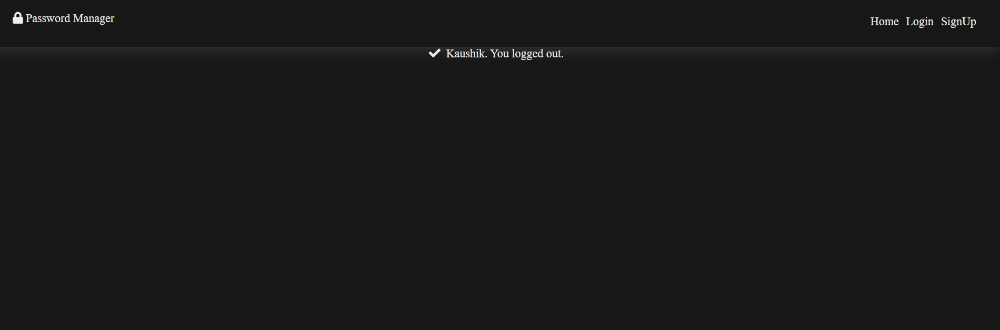
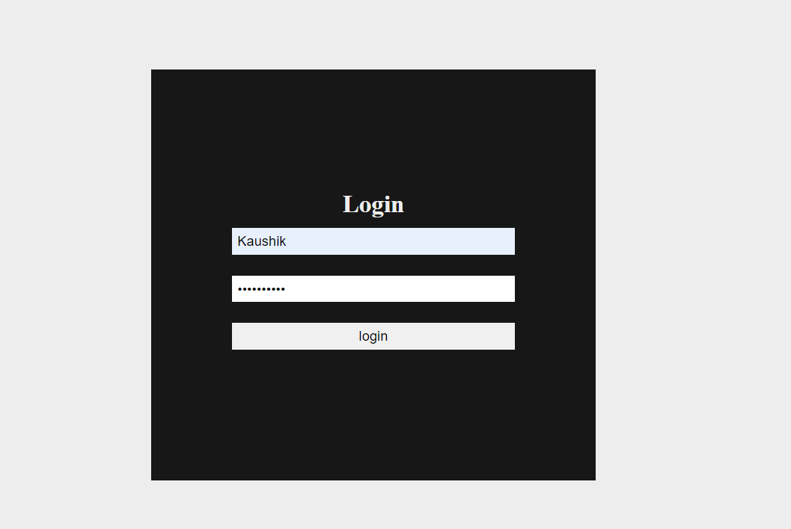

# PasswordManager_Django
 
This project is a password manager website built using Python and Django.
It allows users to securely store and manage their passwords for various accounts and services.
  

Features  
User registration and login 
Proper Authentication for security 
Add new passwords with username and password fields 
Edit and delete existing passwords 
View all saved passwords in a table view 
Search functionality to find specific passwords 

 

  

  

  

  
 
